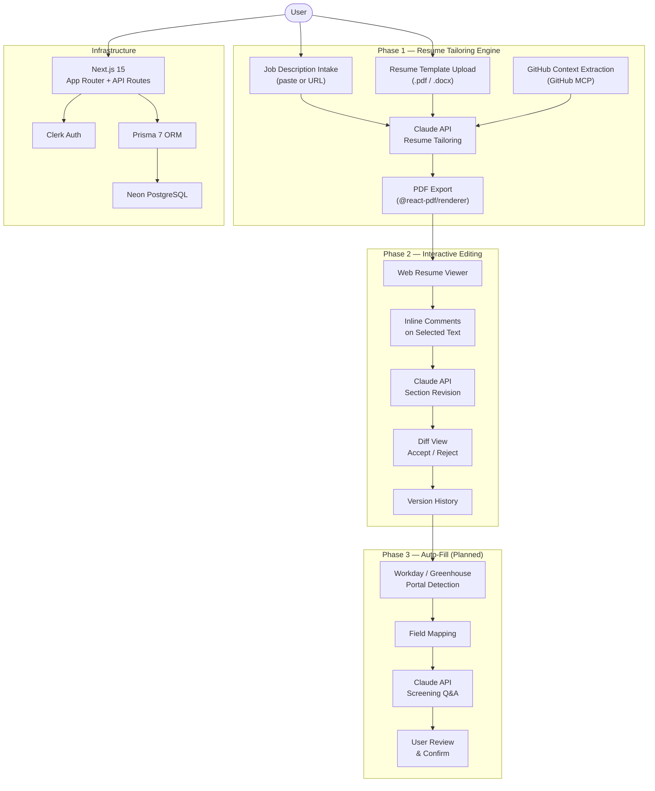

# BypassHire

[](https://github.com/sunlipeipei/cs7180-project3/actions/workflows/ci.yml)

AI-powered job application automation that cuts per-application time from 30-60 minutes to under 5.

**Deployed at:** [Vercel deploy — ongoing, URL TBD]

---

## What BypassHire Does

BypassHire is a full-stack Next.js application built for software engineers who apply to many roles. It accepts a job description and a master resume profile, calls the Claude API (via OpenRouter) to generate a tailored resume, lets the user refine it through an interactive editing interface, and exports a print-ready PDF. Phase 1 ships the complete resume tailoring engine. Phase 2 adds inline comment-based revision with diff/accept-reject. Phase 3 (planned) maps the finalized resume to Workday and Greenhouse form fields via a browser extension — with explicit user confirmation before any submission.

---

## Architecture



---

## Tech Stack

| Layer      | Technology                   | Notes                                              |
| ---------- | ---------------------------- | -------------------------------------------------- |
| Framework  | Next.js 15 (App Router)      | Full-stack, Vercel-native, RSC support             |
| Database   | PostgreSQL via Neon          | Serverless-friendly, Vercel integration            |
| ORM        | Prisma 7 (driver adapters)   | Type-safe queries, migration history               |
| Auth       | Clerk (`@clerk/nextjs` ^7)   | Managed auth, Next.js middleware integration       |
| AI         | OpenRouter / Claude API      | `openai` SDK pointed at OpenRouter; Anthropic core |
| Validation | Zod ^3                       | Runtime schema validation on all API boundaries    |
| Styling    | Tailwind CSS 4               | Utility-first; Radix UI primitives                 |
| PDF        | @react-pdf/renderer ^4       | Server-side PDF generation from React components   |
| Testing    | Vitest ^3 + Playwright ^1.59 | Unit/integration + E2E                             |
| Deploy     | Vercel                       | Preview deploys, env var management                |
| CI/CD      | GitHub Actions               | Lint, typecheck, tests, security, deploy           |

---

## Getting Started

### Prerequisites

- Node.js >= 18
- A Neon PostgreSQL database (or any Postgres instance)
- Clerk account (for auth)
- OpenRouter API key (for Claude access)

### Environment Variables

Copy `.env.example` to `.env.local` and fill in:

```bash
# Database
DATABASE_URL="postgresql://..."          # Neon connection string (sslmode=require)
DATABASE_URL_TEST="postgresql://..."     # Separate test database (optional; falls back to DATABASE_URL)

# Authentication — Clerk
NEXT_PUBLIC_CLERK_PUBLISHABLE_KEY="pk_..."
CLERK_SECRET_KEY="sk_..."
NEXT_PUBLIC_CLERK_SIGN_IN_URL="/sign-in"
NEXT_PUBLIC_CLERK_SIGN_UP_URL="/sign-up"
CLERK_WEBHOOK_SECRET="whsec_..."        # For the /api/webhooks/clerk user-sync route

# AI
OPENROUTER_API_KEY="sk-or-..."

# MCP servers (Claude Code development only — not required to run the app)
GITHUB_PERSONAL_ACCESS_TOKEN="ghp_..."  # GitHub MCP: repo read scope
VERCEL_API_TOKEN="..."                  # Vercel MCP: deployment inspection
GOOG_API_KEY="..."                      # Google Stitch MCP
```

### Install and Run

```bash
npm install

# Apply database migrations
npm run db:migrate

# Start development server
npm run dev
```

Open [http://localhost:3000](http://localhost:3000).

---

## Scripts

| Command                    | Description                                                        |
| -------------------------- | ------------------------------------------------------------------ |
| `npm run dev`              | Start Next.js dev server                                           |
| `npm run build`            | `prisma generate` + `next build`                                   |
| `npm run lint`             | ESLint via `next lint`                                             |
| `npm test`                 | Vitest unit tests (`vitest run`)                                   |
| `npm run test:watch`       | Vitest in watch mode                                               |
| `npm run test:integration` | Integration tests against real DB (`vitest.integration.config.ts`) |
| `npm run test:coverage`    | Vitest with v8 coverage report                                     |
| `npm run db:migrate`       | `prisma migrate dev` — create and apply migrations                 |
| `npm run db:studio`        | Open Prisma Studio                                                 |
| `npm run format`           | Prettier format all files                                          |

---

## Claude Code Features in Use

This project uses Claude Code's full automation stack. See `CLAUDE.md` for the complete development workflow.

### Hooks (`.claude/settings.json`)

- **lint-on-edit** (PostToolUse / Edit|Write): Runs ESLint against any modified `.ts` or `.tsx` file immediately after each edit and reports violations inline.
- **Stop test-runner guard** (Stop event): Runs `npm test` before the Claude Code session ends. Blocks session close if any tests are failing.
- **commit-signal-tests** (PostToolUse / Bash): After any test runner exits 0, injects a nudge asking whether to commit a checkpoint. Never commits automatically.
- **commit-signal-tasks** (PostToolUse / TodoWrite): After a todo transitions to `completed`, emits a nudge to commit the completed slice. Snapshot-based; does not re-fire for the same completion.

Kill switch for commit hooks: `BYPASSHIRE_DISABLE_COMMIT_HOOKS=1`.

### MCP Servers (`.mcp.json`)

| Server     | Package / Image                            | Purpose                                                        |
| ---------- | ------------------------------------------ | -------------------------------------------------------------- |
| github     | `ghcr.io/github/github-mcp-server`         | Fetch repo metadata, file contents, and language stats         |
| vercel     | `vercel-mcp-server` (npx)                  | Check deployment status, inspect env vars, tail logs           |
| stitch     | HTTP — `https://stitch.googleapis.com/mcp` | Google Stitch design services                                  |
| playwright | `@playwright/mcp` (npx)                    | Browser automation for E2E — navigate, click, fill, screenshot |

### Agents (`.claude/agents/`)

- `architect.md` — System-level design and ADR capture (Opus model)
- `planner.md` — Design-before-code planning with step-by-step task lists
- `tdd-guide.md` — Enforces RED → GREEN → REFACTOR cycle
- `code-reviewer.md` — Security (CRITICAL), quality (HIGH), performance (MEDIUM)
- `build-error-resolver.md` — Minimal-diff fixes for build and type errors
- `e2e-runner.md` — Generates and executes Playwright E2E journeys

### Skills (`.claude/skills/`)

`architecture-decision-records`, `backend-patterns`, `coding-standards`, `e2e-testing`, `fix-issue`, `playwright-cli`, `react-components`, `tdd-workflow`, `verification-loop`

---

## Testing Strategy

Unit and integration tests run with Vitest. Unit tests mock external dependencies; integration tests run against a real Neon database (using `DATABASE_URL_TEST` if set, falling back to `DATABASE_URL`). End-to-end tests use Playwright against a locally running Next.js dev server and cover the golden path: sign-in, profile upload, job description entry, resume tailoring, and PDF export. Coverage thresholds are enforced at **70% overall**, **90% on `src/profile/`**, and **100% on auth/core paths**. The `test-runner guard` hook prevents the Claude Code session from closing while any test is red. See `docs/testing-strategy.md` for full details.

---

## CI/CD Pipeline

Every PR and every push to `main` runs through an 8-stage GitHub Actions pipeline. The build graph and AI review are defined in `.github/workflows/`.

| #   | Stage                          | Workflow                       |   Blocks merge?   | Notes                                                                               |
| --- | ------------------------------ | ------------------------------ | :---------------: | ----------------------------------------------------------------------------------- |
| 1   | **Lint**                       | `ci.yml` / `lint`              |        Yes        | ESLint + Prettier                                                                   |
| 2   | **Typecheck**                  | `ci.yml` / `typecheck`         |        Yes        | `tsc --noEmit`                                                                      |
| 3   | **Unit tests + coverage**      | `ci.yml` / `unit-test`         |        Yes        | Vitest; coverage comment on PR                                                      |
| 3b  | **Integration tests (Neon)**   | `ci.yml` / `integration-tests` |        Yes        | Skips gracefully when `DATABASE_URL_TEST` is unset                                  |
| 4   | **Security scan**              | `ci.yml` / `security`          |        Yes        | `npm audit` (fail on high/critical) + GitHub CodeQL (SAST)                          |
| 5   | **Build**                      | `ci.yml` / `build`             |        Yes        | `npm run build` (Prisma generate + Next build)                                      |
| 6   | **AI PR review**               | `claude-review.yml`            | **No (advisory)** | `anthropics/claude-code-action@v1` posts a C.L.E.A.R. + security DoD review comment |
| 7   | **E2E (Playwright)**           | `ci.yml` / `e2e`               |        Yes        | Chromium against `next dev` with `DEV_AUTH_BYPASS=1`                                |
| 8   | **Preview deploy (Vercel)**    | `ci.yml` / `deploy-preview`    |        No         | PRs only; posts preview URL as a PR comment                                         |
| 8   | **Production deploy (Vercel)** | `ci.yml` / `deploy-production` |        n/a        | `main` pushes only, after E2E passes                                                |

### AI PR Review setup

Stage 6 uses a Claude Code subscription OAuth token so no per-PR API billing is required. To provision:

1. Run `claude setup-token` locally and copy the long-lived token.
2. Add it as a GitHub Actions secret named `CLAUDE_CODE_OAUTH_TOKEN` (Repo → Settings → Secrets and variables → Actions).
3. Open any PR — the review comment appears within a minute or two of CI start.

If the token is missing the stage fails red, but `continue-on-error: true` keeps the PR unblocked.

---

## Security

Security is treated as a first-class requirement throughout the codebase. See `docs/security.md` for the complete OWASP Top 10 mapping. Key controls:

- **A01 Broken Access Control**: All DB queries scope to `userId` obtained from the Clerk server-side session — never from request body or URL params.
- **A02 Cryptographic Failures**: Secrets managed via Vercel environment variables; `.env` is gitignored; Neon connections require `sslmode=require`.
- **A03 Injection**: Prisma parameterized queries for SQL; Zod validates all API input; job description content is wrapped in prompt delimiters to prevent prompt injection.
- **A04 Insecure Design**: Phase 3 auto-fill will never submit a form without explicit user confirmation (FR-3.5, hard product requirement).
- **A07 Auth Failures**: Clerk manages all authentication; `userId` is always obtained server-side via `auth()`; ESLint enforces that API routes import from `src/lib/auth`, not directly from `@clerk/nextjs/server`.
- **A10 SSRF**: GitHub repo URLs from users are validated against an allowlist regex before any fetch.

`npm audit` runs in CI on every PR; high/critical vulnerabilities block merge.

---

## Project Structure

```
cs7180-project3/
├── app/                    # Next.js App Router pages and API routes
│   ├── api/                # REST API routes (resumes, profile, webhooks, PDF)
│   ├── sign-in/            # Clerk sign-in page
│   ├── sign-up/            # Clerk sign-up page
│   ├── layout.tsx
│   └── page.tsx
├── src/
│   ├── profile/            # MasterProfile type, Zod schema, repository, merge logic
│   ├── lib/                # Prisma singleton, DB adapters, auth helpers
│   ├── ai/                 # Claude/OpenRouter client and prompt builders
│   ├── ingestion/          # Resume parsing (PDF/DOCX ingestion)
│   ├── pdf/                # React-PDF resume template
│   ├── services/           # Business logic services (tailor, refine)
│   ├── middleware/         # Shared Next.js middleware utilities
│   ├── generated/          # Prisma client (do not edit)
│   └── test/               # Shared test setup (dotenv loader, fixtures)
├── prisma/
│   ├── schema.prisma       # Data model: User, Profile, JobDescription, Resume
│   └── migrations/         # Prisma migration history
├── e2e/                    # Playwright E2E test suites
├── components/             # Shared React components
├── docs/                   # Architecture, PRD, testing strategy, security
│   └── final_delivery/     # [TBD] Screenshots and deliverables for submission
└── .claude/
    ├── settings.json       # Claude Code hooks configuration
    ├── agents/             # Specialized sub-agents (architect, planner, etc.)
    ├── skills/             # Reusable skill definitions
    └── hooks/              # Hook scripts (commit_signal_green.sh, etc.)
```

---

## Data Model

Defined in `prisma/schema.prisma`:

- **User** — Clerk user ID (primary key) + email. Parent of all user data.
- **Profile** — One-to-one with User. Stores `MasterProfile` JSON (see `src/profile/types.ts`).
- **JobDescription** — Stores full JD text, title, company, and optional source URL. Scoped to `userId`.
- **Resume** — Tailored resume content as structured JSON, optional PDF path, linked to a `JobDescription`. Scoped to `userId`.

All models cascade-delete on `User` removal. All repository queries receive `userId` from the Clerk server-side session.

---

## Screenshots

Placeholder paths for final submission. Run the capture commands below after `npm run dev`:

```
docs/final_delivery/screenshots/
├── 01-sign-in.png
├── 02-dashboard.png
├── 03-profile-upload.png
├── 04-tailor-jd-entry.png
├── 05-tailor-result.png
└── 06-pdf-output.png
```

Suggested capture sequence (Playwright MCP or manual):

```bash
# 1. Sign-in page
open http://localhost:3000/sign-in

# 2. Dashboard (after auth)
open http://localhost:3000

# 3. Profile upload / onboarding flow
open http://localhost:3000/profile

# 4. Resume tailoring — JD entry
open http://localhost:3000/tailor

# 5. Tailored resume result + refine panel
# (complete the tailor form and capture the output view)

# 6. PDF export
# (click "Export PDF" on the result page)
```


---

## Team

| Name         | GitHub                                         | Role       |
| ------------ | ---------------------------------------------- | ---------- |
| Lipeipei Sun | [@sunlipeipei](https://github.com/sunlipeipei) | Full-stack |
| Dako         | [@dako7777777](https://github.com/dako7777777) | Full-stack |

---

## License and Acknowledgments

This project was developed as CS7180 Project 3. All AI-assisted development was performed using Claude Code (Anthropic) following the disclosure and workflow conventions documented in `CLAUDE.md`. Resume tailoring is powered by Anthropic Claude via OpenRouter. Authentication is provided by Clerk. Database hosting is provided by Neon.

Source code is for academic evaluation purposes. No license for redistribution is granted at this time.
